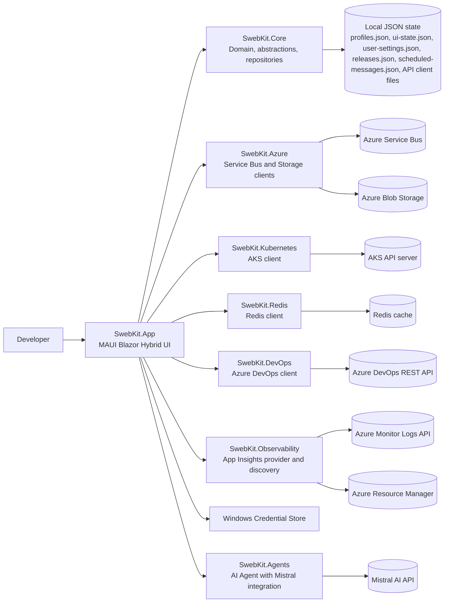

# SwebKit Architecture

## Mandate

**This is the system-wide map.** It answers: _what are the major components and how do they connect?_

Update this file when top-level projects, external integrations, or runtime boundaries change.

## Purpose

SwebKit is a .NET MAUI Blazor Hybrid desktop operations tool for Azure-focused development workflows. The architecture separates UI orchestration (`SwebKit.App`) from domain contracts and persistence (`SwebKit.Core`), with integration projects per external platform (`SwebKit.Azure`, `SwebKit.Kubernetes`, `SwebKit.Redis`, `SwebKit.DevOps`, `SwebKit.Observability`). This keeps feature work isolated by capability while sharing consistent configuration, credential, and state-management patterns.

## System Context

- Desktop entry point and DI composition: `src/SwebKit.App/MauiProgram.cs`
- Blazor shell host: `src/SwebKit.App/MainPage.xaml` and `src/SwebKit.App/Components/Layout/MainLayout.razor`
- Shared domain and persistence contracts: `src/SwebKit.Core`
- Local persisted state: `%APPDATA%/SwebKit` (`profiles.json`, `ui-state.json`, `user-settings.json`, `releases.json`, `scheduled-messages.json`, API Client `collections.json`, `environments.json`, `api-linked-roots.json`, plus sibling `.bak` recovery copies where repository-backed) and a `logs/` subfolder holding per-feature-per-day structured log files (`<feature>-yyyy-MM-dd.log`)
- External runtime integrations:
  - Azure Service Bus and Azure Blob Storage
  - AKS Kubernetes API
  - Redis
  - Azure DevOps REST API
  - Azure Monitor Logs API and Azure Resource Manager (Application Insights discovery)
  - Git CLI for user-configured API Client linked repositories
  - Mistral AI API for agent capabilities

## High-Level Flow

## Runtime Components

### SwebKit.App (`src/SwebKit.App`)

Responsibility: MAUI + Blazor host, page routing, UI composition, and app-level orchestration.

Key files:

- `src/SwebKit.App/MauiProgram.cs`
- `src/SwebKit.App/MainPage.xaml`
- `src/SwebKit.App/Components/Routes.razor`
- `src/SwebKit.App/Components/Layout/MainLayout.razor`
- `src/SwebKit.App/Components/Pages/ServiceBusPage.razor`
- `src/SwebKit.App/Components/Pages/IncidentTimelinePage.razor`

### SwebKit.Core (`src/SwebKit.Core`)

Responsibility: domain models, integration abstractions, repositories, and shared app services.

Key files:

- `src/SwebKit.Core/Domain/AppConfig.cs`
- `src/SwebKit.Core/Abstractions/IServiceBusClient.cs`
- `src/SwebKit.Core/Services/AppStateService.cs`
- `src/SwebKit.Core/Configuration/ProfileRepository.cs`
- `src/SwebKit.Core/Configuration/UiStateRepository.cs`

### SwebKit.Azure (`src/SwebKit.Azure`)

Responsibility: Azure Service Bus and Blob Storage SDK-backed client implementations.

Key files:

- `src/SwebKit.Azure/ServiceBus/AzureServiceBusClient.cs`
- `src/SwebKit.Azure/Storage/AzureStorageClient.cs`
- `src/SwebKit.Azure/Storage/BinaryContentDetector.cs`

### SwebKit.Kubernetes (`src/SwebKit.Kubernetes`)

Responsibility: AKS and Kubernetes operations (contexts, resources, logs, shell, port-forward, Helm support).

Key files:

- `src/SwebKit.Kubernetes/AksClient/KubernetesAksClient.cs`

### SwebKit.Agents (`src/SwebKit.Agents`)

Responsibility: AI Agent integration with Mistral AI, tool-based architecture, and conversational interface.

Key files:

- `src/SwebKit.Agents/IMistralClient.cs` - Core Mistral integration interface
- `src/SwebKit.Agents/MistralHttpClient.cs` - Mistral API client implementation
- `src/SwebKit.Agents/AgentChatService.cs` - Main agent orchestrator
- `src/SwebKit.Agents/AgentToolRegistry.cs` - Tool discovery and execution
- `src/SwebKit.Agents/IAgentTool.cs` - Tool interface
- `src/SwebKit.Agents/Tools/` - All agent tools implementation

### SwebKit.Redis (`src/SwebKit.Redis`)

Responsibility: Redis data and admin operations via StackExchange.Redis.

Key files:

- `src/SwebKit.Redis/RedisClient.cs`
- `src/SwebKit.Redis/RedisValueHelpers.cs`

### SwebKit.DevOps (`src/SwebKit.DevOps`)

Responsibility: Azure DevOps REST integration for pipelines, runs, approvals, repositories, and tags.

Key files:

- `src/SwebKit.DevOps/DevOpsClient.cs`
- `src/SwebKit.DevOps/DevOpsAuthHandler.cs`
- `src/SwebKit.DevOps/AdoApiModels.cs`

### SwebKit.Observability (`src/SwebKit.Observability`)

Responsibility: Application Insights resource discovery and KQL query execution.

Key files:

- `src/SwebKit.Observability/AzureAppInsightsProvider.cs`
- `src/SwebKit.Observability/AppInsightsDiscoveryService.cs`
- `src/SwebKit.Observability/KqlPresets.cs`

## Functional Deep Dives

Feature-level behavior notes live in `docs/architecture/functionalities/`:

- `docs/architecture/functionalities/agent.md` - AI Agent with Mistral AI integration
- `docs/architecture/functionalities/service-bus.md`
- `docs/architecture/functionalities/dashboard.md`
- `docs/architecture/functionalities/aks.md`
- `docs/architecture/functionalities/redis.md`
- `docs/architecture/functionalities/storage.md`
- `docs/architecture/functionalities/releases.md`
- `docs/architecture/functionalities/observability.md`
- `docs/architecture/functionalities/incident-timeline.md`
- `docs/architecture/functionalities/settings-and-configuration.md`
- `docs/architecture/functionalities/api-client.md`

## Cross-Cutting Concerns

| Concern                                 | Where it lives                                                                                                                                                                                                                                                                                  | Notes                                                                                                                                                                                                                                                                                                                      |
| --------------------------------------- | ----------------------------------------------------------------------------------------------------------------------------------------------------------------------------------------------------------------------------------------------------------------------------------------------- | -------------------------------------------------------------------------------------------------------------------------------------------------------------------------------------------------------------------------------------------------------------------------------------------------------------------------- |
| Dependency injection                    | `src/SwebKit.App/MauiProgram.cs`                                                                                                                                                                                                                                                                | Registers core services, platform services, and infrastructure clients.                                                                                                                                                                                                                                                    |
| Credentials and secrets                 | `src/SwebKit.App/Platforms/Windows/WindowsCredentialStore.cs`                                                                                                                                                                                                                                   | Secrets are resolved at runtime and not persisted in JSON config files.                                                                                                                                                                                                                                                    |
| App-data persistence                    | `src/SwebKit.Core/Configuration/ProfileRepository.cs`, `src/SwebKit.Core/Configuration/UiStateRepository.cs`, `src/SwebKit.Core/Configuration/UserSettingsRepository.cs`, `src/SwebKit.Core/Configuration/ReleaseRepository.cs`, `src/SwebKit.Core/Configuration/ScheduledMessageRepository.cs` | Backed by `%APPDATA%/SwebKit` files via `AppDataPaths`, with atomic writes and `.bak` recovery copies.                                                                                                                                                                                                                     |
| API Client persistence and linked roots | `src/SwebKit.Core/Configuration/CollectionRepository.cs`, `src/SwebKit.Core/Configuration/EnvironmentRepository.cs`, `src/SwebKit.Core/Configuration/LinkedCollectionRootRepository.cs`, `src/SwebKit.Core/Services/LinkedCollectionFileService.cs`                                             | Local JSON state plus optional `.swebkit-api/` folders inside user repositories.                                                                                                                                                                                                                                           |
| Eventing and shared app state           | `src/SwebKit.Core/Services/AppEventBus.cs`, `src/SwebKit.Core/Services/AppStateService.cs`                                                                                                                                                                                                      | Coordinates area navigation, refresh events, and shared app state.                                                                                                                                                                                                                                                         |
| Demo mode routing                       | `src/SwebKit.Core/Services/Demo*Client.cs`, `src/SwebKit.Core/Services/DemoObservabilityProvider.cs`                                                                                                                                                                                            | `UseDemoData` toggles between real and synthetic providers.                                                                                                                                                                                                                                                                |
| AI Agent integration                    | `src/SwebKit.Agents/IMistralClient.cs`, `src/SwebKit.Agents/MistralHttpClient.cs`, `src/SwebKit.Agents/AgentChatService.cs`, `src/SwebKit.Agents/AgentToolRegistry.cs`, `src/SwebKit.Agents/Tools/`                                                                                             | Mistral AI integration with tool-based architecture for DevOps assistance.                                                                                                                                                                                                                                                 |
| HTTP resilience                         | `src/SwebKit.App/MauiProgram.cs` and `src/SwebKit.DevOps/DevOpsClient.cs`                                                                                                                                                                                                                       | Azure DevOps named HttpClient uses standard resilience handler with retries.                                                                                                                                                                                                                                               |
| Command and shortcut system             | `src/SwebKit.App/Services/CommandRegistry.cs`, `src/SwebKit.App/wwwroot/js/keyboardShortcuts.js`                                                                                                                                                                                                | Global and area-scoped commands drive keyboard workflows.                                                                                                                                                                                                                                                                  |
| Workspace and resource navigation       | `src/SwebKit.App/Services/OperatorWorkspaceService.cs`, `src/SwebKit.Core/Domain/WorkspaceModels.cs`, `src/SwebKit.Core/Configuration/ProfileRepository.cs`, `src/SwebKit.Core/Configuration/UiStateRepository.cs`                                                                              | Provider-backed search, named favorites, recents, and route-first snapshot restore live here.                                                                                                                                                                                                                              |
| Structured file logging                 | `src/SwebKit.Core/Diagnostics/` (`FileLoggerProvider`, `FileLogger`, `DailyFileWriter`, `LogRetentionCleanupService`, `LogRedactor`), registered via `builder.Logging.AddProvider(...)` in `src/SwebKit.App/MauiProgram.cs`                                                                     | Custom `ILoggerProvider` writing redacted NDJSON to per-feature-per-day files in `%APPDATA%/SwebKit/logs/`; 7-day age-based cleanup; crash-safe emergency write path bypasses the channel for `AppDomain.UnhandledException`/`TaskScheduler.UnobservedTaskException`. See `docs/features/active/structured-file-logging/`. |

## Where To Start For Common Tasks

| Task                                                                        | Start here                                                                                                                                                                                                                |
| --------------------------------------------------------------------------- | ------------------------------------------------------------------------------------------------------------------------------------------------------------------------------------------------------------------------- |
| Add or change app-level service registration                                | `src/SwebKit.App/MauiProgram.cs`                                                                                                                                                                                          |
| Add a new routed page and navigation entry                                  | `src/SwebKit.App/Components/Pages/` and `src/SwebKit.App/Components/Layout/LeftNav.razor`                                                                                                                                 |
| Extend dashboard tiles, dashboard readiness, or dashboard customization     | `src/SwebKit.App/Components/Pages/DashboardPage.razor`, `src/SwebKit.App/Components/Shared/HealthTile.razor`, and `src/SwebKit.Core/Configuration/UiStateRepository.cs`                                                   |
| Extend persisted app configuration                                          | `src/SwebKit.Core/Domain/AppConfig.cs` and `src/SwebKit.Core/Configuration/ProfileRepository.cs`                                                                                                                          |
| Extend shell resource search, named favorites, recents, or snapshot restore | `src/SwebKit.App/Services/OperatorWorkspaceService.cs`, `src/SwebKit.App/Services/OperatorResourceSearchProviders.cs`, and `src/SwebKit.Core/Domain/WorkspaceModels.cs`                                                   |
| Implement a new Service Bus operation                                       | `src/SwebKit.Core/Abstractions/IServiceBusClient.cs` and `src/SwebKit.Azure/ServiceBus/AzureServiceBusClient.cs`                                                                                                          |
| Add AKS diagnostics behavior                                                | `src/SwebKit.Core/Abstractions/IAksClient.cs` and `src/SwebKit.Kubernetes/AksClient/KubernetesAksClient.cs`                                                                                                               |
| Extend Observability querying or discovery                                  | `src/SwebKit.Core/Abstractions/IObservabilityProvider.cs` and `src/SwebKit.Observability/AzureAppInsightsProvider.cs`                                                                                                     |
| Add or modify agent tools                                                   | `src/SwebKit.Agents/IAgentTool.cs` and `src/SwebKit.Agents/Tools/`                                                                                                                                                        |
| Extend agent capabilities or Mistral integration                            | `src/SwebKit.Agents/IMistralClient.cs`, `src/SwebKit.Agents/MistralHttpClient.cs`, and `src/SwebKit.Agents/AgentChatService.cs`                                                                                           |
| Extend the incident timeline workbench UI                                   | `src/SwebKit.App/Components/Pages/IncidentTimelinePage.razor`, `src/SwebKit.App/Components/IncidentTimeline/`, and `src/SwebKit.Core/Abstractions/IIncidentTimelineService.cs`                                            |
| Add Azure DevOps Pipelines/Releases workflow behavior                       | `src/SwebKit.Core/Abstractions/IDevOpsClient.cs` and `src/SwebKit.DevOps/DevOpsClient.cs`                                                                                                                                 |
| Extend API Client requests, variables, linked roots, or Git actions         | `src/SwebKit.App/Components/ApiClient/ApiClientPage.razor`, `src/SwebKit.Core/Domain/ApiClientModels.cs`, `src/SwebKit.Core/Services/LinkedCollectionFileService.cs`, and `src/SwebKit.Core/Services/LinkedGitService.cs` |
