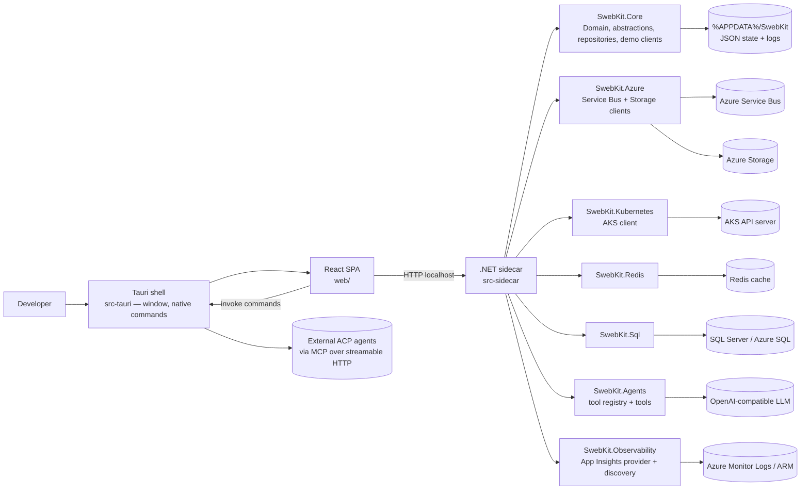

# SwebKit Architecture

## Mandate

**This is the system-wide map.** It answers: _what are the major components and how do they connect?_

Update this file when top-level projects, external integrations, or runtime boundaries change.

## Purpose

SwebKit is a desktop operations tool for Azure-focused development workflows. The active stack is a
**Tauri (Rust) shell** wrapping a **React SPA** that talks to a **local .NET sidecar** (ASP.NET
Minimal API) over localhost. The sidecar owns every integration with external systems and all
persisted state; the Rust layer provides native capabilities (process spawning, pod shells,
port-forwarding, file dialogs, git, OS keychain) that a browser sandbox cannot.

## System Context

- Desktop entry point: `src-tauri/src/main.rs` → `src-tauri/src/lib.rs` (command/plugin registration)
- UI entry point: `web/src/main.tsx` → `web/src/App.tsx` (lazy routes)
- API composition root: `src-sidecar/Program.cs` (DI + per-feature `Map*Endpoints`)
- Local persisted state: `%APPDATA%/SwebKit` (`profiles.json`, `ui-state.json`,
  `user-settings.json`, `releases.json`, `scheduled-messages.json`, `collections.json`,
  `environments.json`, `api-linked-roots.json`, plus sibling `.bak` recovery copies) and a `logs/`
  subfolder with per-feature-per-day structured log files
- External runtime integrations:
    - Azure Service Bus and Azure Blob/Files Storage
    - AKS Kubernetes API (incl. exec/shell and port-forward via `kubectl`/`kubelogin` processes)
    - Redis
    - SQL Server / Azure SQL (Microsoft Entra-only)
    - Azure Monitor Logs API + ARM (Application Insights, agent tools only)
    - OpenAI-compatible LLM endpoints (agent) and external ACP agents (MCP bridge)
    - Git CLI for API Client linked repositories

## High-Level Flow

## Runtime Components

### Tauri shell (`src-tauri/`)

Responsibility: window hosting, spawning/owning the sidecar process, and native commands the web
sandbox cannot do. Commands return `Result<_, String>`; the web side calls them through
`web/src/lib/tauri-bridge.ts` (which no-ops in plain browser dev).

Key files:

- `src-tauri/src/lib.rs` — plugin + `invoke_handler` registration
- `src-tauri/src/sidecar.rs` — sidecar process lifecycle; `get_sidecar_port` (prod uses an
  OS-assigned port; dev fixes `http://127.0.0.1:5199`)
- `src-tauri/src/native.rs` — kubectl port-forward sessions, file/folder pickers, clipboard,
  reveal-in-explorer
- `src-tauri/src/pod_shell.rs` — `kubectl exec` interactive pod shells (xterm.js backend)
- `src-tauri/src/git.rs` — allowlisted git operations for API Client linked repos
  (`AllowedRoots` guards every command)
- `src-tauri/src/secrets.rs` — OS keychain get/set/delete/list for API Client credentials

### React frontend (`web/`)

Responsibility: all UI. React 19 + TypeScript + Vite, Tailwind v4, CodeMirror 6, TanStack Query
for server state, zustand stores for client state, xterm.js for pod shells.

Key files:

- `web/src/main.tsx` — QueryClient defaults (`staleTime: 30s`, `refetchOnWindowFocus: false`),
  awaits `initSidecarBaseUrl()` before render
- `web/src/App.tsx` — lazy routes per feature page
- `web/src/lib/api.ts` — `apiFetch`/`apiSend` wrappers + typed endpoint functions
- `web/src/lib/types.ts` — TS mirror of the sidecar domain models
- `web/src/lib/hooks/` — per-feature TanStack Query hooks (`useServiceBus`, `useAks`, …)
- `web/src/lib/stores/` — zustand stores (selection, filters, panel prefs, agent conversation)
- `web/src/components/<feature>/` — page components; big pages carry a `*PageContext.tsx`
  provider (known smell — see the quality program plan)
- `web/e2e/` — Playwright suite running against demo mode

### .NET sidecar (`src-sidecar/`)

Responsibility: every backend operation — one ASP.NET Minimal API process, singleton DI,
per-feature endpoint modules and per-feature singleton connection pools.

Key files:

- `src-sidecar/Program.cs` — DI wiring grouped by feature, CORS (localhost/Tauri origins only),
  global exception handler (secret-safe messages, classified status codes)
- `src-sidecar/Endpoints/*.cs` — `Map*Endpoints` extension per feature
- `src-sidecar/Services/Sidecar*ConnectionPool.cs` — pooled SDK clients per configured resource
- `src-sidecar/Services/` — agent chat, monitoring alert engine (hosted service), proactive
  insights, credential store, auth-header builder
- `src-sidecar/Services/Acp/` — ACP agent host (spawns external agents, exposes SwebKit tools
  over MCP) — stateless MCP server, tool allowlist travels in the session URL's `?tools=`

### `SwebKit.Core` (`src/SwebKit.Core`)

Responsibility: framework-agnostic contracts, domain/config models, JSON repositories,
`AppStateService`/`AppEventBus`, `Demo*` implementations, importers, structured file logging
(`Diagnostics/`).

Key folders: `Abstractions/` (`I*Client`, `I*ConnectionPool`, `IAgentTool` infra contracts),
`Domain/` (persisted `AppConfig` et al.), `Models/` (runtime DTOs), `Configuration/` (`*Repository`),
`Services/`, `Serialization/`.

### Integration libraries (`src/SwebKit.*`)

| Project                 | Responsibility                                                                                  |
| ----------------------- | ----------------------------------------------------------------------------------------------- |
| `SwebKit.Azure`         | `AzureServiceBusClient`, `AzureStorageClient` (Service Bus SDK, Azure.Storage.*)                 |
| `SwebKit.Kubernetes`    | `KubernetesAksClient` (contexts, workloads, logs, YAML, Helm, apply) + alert signal sources      |
| `SwebKit.Redis`         | `RedisClient` (StackExchange.Redis) + signal sources                                             |
| `SwebKit.Sql`           | `SqlDatabaseClient` (Entra token, ADO.NET), `SqlStatementGuard` (read-only), ARM discovery       |
| `SwebKit.Agents`        | `IAgentTool`, `AgentToolRegistry`, per-feature tool implementations, `ScreenStateStore`          |
| `SwebKit.Observability` | `AzureAppInsightsProvider`, `AppInsightsDiscoveryService`, KQL presets                            |

## Functional Deep Dives

Feature-level behavior notes live in `docs/architecture/functionalities/`. ⚠ Several still describe
the retired MAUI UI — they are being rewritten per feature during the codebase-quality program
(`docs/features/active/codebase-quality-program.md`); prefer code over any `.razor` pointer.

- `functionalities/dashboard.md`
- `functionalities/service-bus.md`
- `functionalities/aks.md`
- `functionalities/redis.md`
- `functionalities/sql.md`
- `functionalities/storage.md`
- `functionalities/observability.md`
- `functionalities/monitoring.md`
- `functionalities/settings-and-configuration.md`
- `functionalities/api-client.md`
- `functionalities/agent.md`

## Cross-Cutting Concerns

| Concern                        | Where it lives                                                                                                                  | Notes                                                                                                                                               |
| ------------------------------ | ------------------------------------------------------------------------------------------------------------------------------- | --------------------------------------------------------------------------------------------------------------------------------------------------- |
| Dependency injection           | `src-sidecar/Program.cs`                                                                                                        | Everything is a singleton; per-feature grouped `AddSingleton` blocks.                                                                                |
| Credentials and secrets        | `src-tauri/src/secrets.rs` (OS keychain) + `src-sidecar/Services/SidecarCredentialStore.cs`                                     | Config files reference secrets by logical key only; raw secret material never lands in JSON.                                                         |
| App-data persistence           | `src/SwebKit.Core/Configuration/*Repository.cs` via `ConfigEndpoints.cs`                                                        | `%APPDATA%/SwebKit`, atomic temp-file writes + `.bak` recovery.                                                                                      |
| API Client persistence         | `CollectionRepository`, `EnvironmentRepository`, `LinkedCollectionRootRepository`, `LinkedCollectionFileService`                | Local JSON plus optional `.swebkit-api/` folders inside user git repos.                                                                              |
| Demo mode                      | `src-sidecar/Endpoints/DemoModeService.cs` + `SwebKit.Core/Services/Demo*`                                                      | `AppStateService.UseDemoData` swaps every client for a synthetic one; the whole e2e suite runs on it.                                                |
| Connection pooling             | `src-sidecar/Services/Sidecar*ConnectionPool.cs`                                                                                | One SDK client per configured resource, reused across requests — see `docs/pitfalls/azure-sdk.md`.                                                   |
| Monitoring engine              | `src-sidecar/Services/MonitoringAlertEvaluationService.cs` (hosted service) + `IAlertSignalSource` implementations in each lib | Singleton shared between hosted lifetime and endpoints; SSE stream in `Endpoints/MonitoringEventStream.cs`.                                          |
| Agent                          | `src-sidecar/Services/SidecarAgentChatService.cs`, `SwebKit.Agents/Tools/`, ACP host in `Services/Acp/`                          | `AgentModelClientRouter` picks built-in OpenAI-compatible client vs. external ACP agent per profile. Confirm-before-execute via `IAgentActionCoordinator`. |
| Structured file logging        | `src/SwebKit.Core/Diagnostics/` registered in `Program.cs`                                                                      | Redacted NDJSON to `%APPDATA%/SwebKit/logs/<feature>-yyyy-MM-dd.log`; crash-safe emergency path.                                                     |
| Frontend server state          | `web/src/lib/hooks/use*.ts` (TanStack Query)                                                                                    | `staleTime` 30 s, `refetchOnWindowFocus` off — volatile queries carry their own staleTime.                                                           |
| Frontend client state          | `web/src/lib/stores/` (zustand) + per-page `*PageContext.tsx`                                                                   | URL params (`useSearchParams`) carry deep-linkable selection state.                                                                                  |
| High-volume streaming          | `useLogBuffer` / `log-window.ts`, `MonitoringEventStream` (SSE)                                                                  | Buffer-and-flush, never render per line — see `docs/pitfalls/react-frontend.md`.                                                                      |

## Where To Start For Common Tasks

| Task                                                     | Start here                                                                                                              |
| -------------------------------------------------------- | ----------------------------------------------------------------------------------------------------------------------- |
| Add/change a sidecar service or DI registration          | `src-sidecar/Program.cs`                                                                                                |
| Add an endpoint                                          | The matching `src-sidecar/Endpoints/*Endpoints.cs` (or a new one mirroring them)                                        |
| Add a page/route                                         | `web/src/App.tsx`, `web/src/components/<feature>/`, sidebar nav in `web/src/components/layout/`                         |
| New persisted config field                               | `src/SwebKit.Core/Domain/AppConfig.cs` + mirror in `web/src/lib/types.ts`                                               |
| New Service Bus / Storage / AKS / Redis / SQL operation  | `I*Client` in `Core/Abstractions` → `SwebKit.<lib>` impl → `Sidecar*ConnectionPool` if needed → endpoint + `api.ts`     |
| Add an agent tool                                        | `src/SwebKit.Agents/IAgentTool.cs`, `src/SwebKit.Agents/Tools/`, register in `Program.cs`                               |
| Agent chat / streaming                                   | `src-sidecar/Services/SidecarAgentChatService.cs`, `web/src/lib/hooks/useAgent.ts`                                      |
| Monitoring alert rule / signal source                    | `IAlertSignalSource` impl in the feature lib + `MonitoringAlertEvaluationService`                                        |
| Native capability (files, shell, git, secrets)           | `src-tauri/src/` command + `web/src/lib/tauri-bridge.ts`                                                                |
| Demo-mode behavior                                       | `DemoModeService` + the matching `Demo*Client` in `SwebKit.Core/Services/`                                              |
