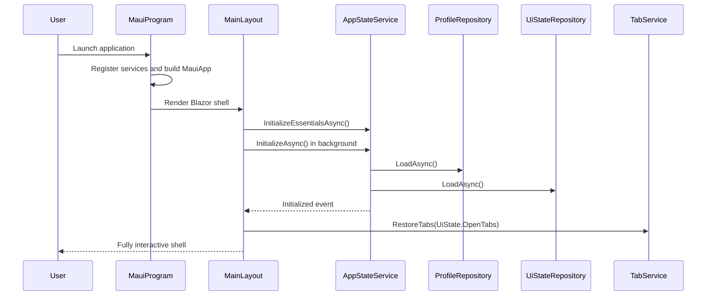
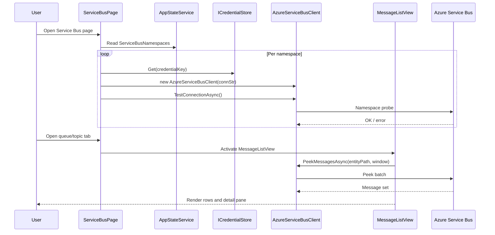
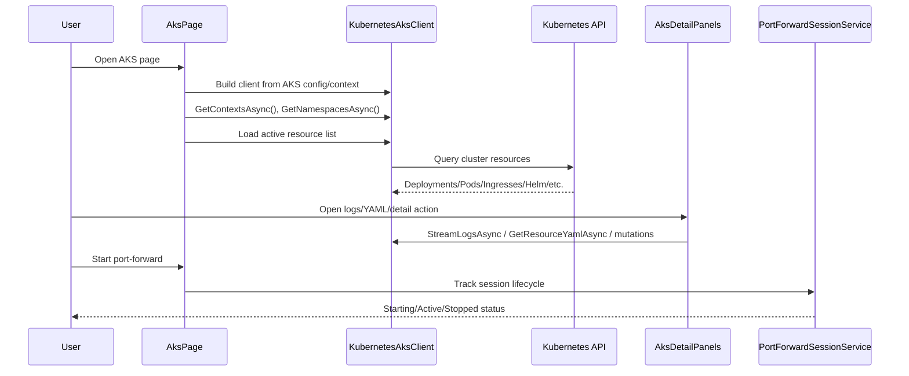
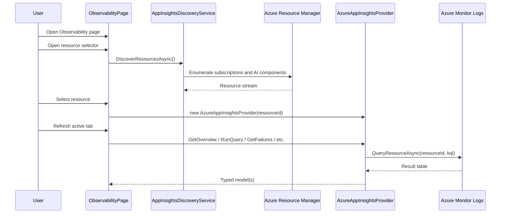
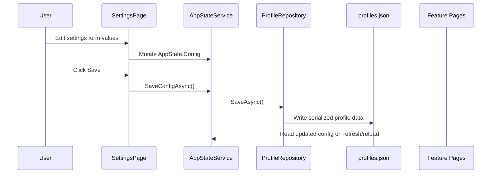

# SwebKit Design

## Mandate

**This is the component blueprint.** It answers: _how is each component internally structured, and what are the key flows through it?_

Update this file when control flow, runtime responsibilities, or integration boundaries change inside a component.

## Scope

This document expands [architecture.md](architecture.md) for the most important implementation flows:

- App bootstrap and shell hydration
- Service Bus namespace connection and message browsing
- AKS diagnostics and side-panel operations
- Observability resource selection and query execution
- Settings persistence and config propagation

Folder maps and broad navigation conventions are intentionally kept in `codebase-guide.md`.

## App Bootstrap Flow

### Intent

Start the MAUI host quickly, hydrate persisted state in the background, and render the shell without blocking initial UI.

### High-Level Sequence

### Design Notes

- `MainLayout` uses two-phase startup: immediate shell render, then full state hydration.
- `AppStateService` raises `Initialized` and `DemoModeChanged` so layouts and pages can re-render safely.
- Keyboard shortcuts are registered from `OnAfterRenderAsync` to avoid JS interop calls before a DOM is available.

## Service Bus Namespace and Message Browse Flow

### Intent

Connect each configured namespace independently, then allow queue/topic tab workflows (peek, filter, compose, DLQ actions) with resilient UI behavior.

### High-Level Sequence

### Design Notes

- Namespace connectivity is fan-out and non-atomic; one namespace can fail while others stay usable.
- Tab state is local (`SbTab`), so each open entity maintains its own selected message and mode.
- Message-list preferences and filter presets are persisted through `UiStateRepository` scope keys.
- Mutative operations (delete, purge, DLQ replay/complete) route through shared `IServiceBusClient` contracts and UI confirmations.

## AKS Diagnostics Flow

### Intent

Provide responsive cluster diagnostics (resource lists, logs, YAML, shell, port-forward) while keeping the grid and navigation usable during side operations.

### High-Level Sequence

### Design Notes

- `KubernetesAksClient` retries on auth failures by rebuilding client config and reapplying Azure token fallback.
- Auto-refresh is intentionally paused when detail panels are open to avoid disrupting active diagnostic context.
- Port-forward process tracking is centralized in `IPortForwardSessionService`, and cleanup runs during process exit.

## Observability Resource and Query Flow

### Intent

Discover accessible Application Insights resources, bind one provider instance to the selected resource, and execute tab-specific KQL queries.

### High-Level Sequence

### Design Notes

- Resource discovery is cached in-memory by `AppInsightsDiscoveryService` for session reuse.
- The selected resource ID/name persists in `AppState.Config.ObservabilityConfig`.
- Demo mode swaps both discovery and provider implementations without changing page-level flow.

## Settings Save and Config Propagation Flow

### Intent

Allow per-environment configuration updates from UI forms while keeping secrets external to configuration files.

### High-Level Sequence

### Design Notes

- Settings edits are in-memory until explicit save.
- Credentials are referenced by logical keys; secret material remains in credential store.
- Environment selection is profile-based (`Environments` and `ActiveEnvironmentName` in `ProfileData`).

## Key Reference Points

| File                                                       | Responsibility                                                                        |
| ---------------------------------------------------------- | ------------------------------------------------------------------------------------- |
| `src/SwebKit.App/MauiProgram.cs`                           | DI composition root and infrastructure registration.                                  |
| `src/SwebKit.App/Components/Layout/MainLayout.razor`       | App shell lifecycle, startup sequencing, and global command registration.             |
| `src/SwebKit.Core/Services/AppStateService.cs`             | Shared app state, initialization, demo mode toggling, and persistence calls.          |
| `src/SwebKit.Core/Configuration/ProfileRepository.cs`      | Profile/environment load-save lifecycle for `profiles.json`.                          |
| `src/SwebKit.Core/Configuration/UiStateRepository.cs`      | UI state persistence (`ui-state.json`) including tabs, filters, and view preferences. |
| `src/SwebKit.App/Components/Pages/ServiceBusPage.razor`    | Service Bus page orchestration, namespace lifecycle, tab workspace behavior.          |
| `src/SwebKit.Azure/ServiceBus/AzureServiceBusClient.cs`    | Service Bus SDK implementation and message/entity operations.                         |
| `src/SwebKit.App/Components/Pages/AksPage.razor`           | AKS page orchestration and resource panel lifecycle.                                  |
| `src/SwebKit.Kubernetes/AksClient/KubernetesAksClient.cs`  | Kubernetes operations, auth fallback, and log/port-forward behavior.                  |
| `src/SwebKit.App/Components/Pages/ObservabilityPage.razor` | Resource selection, tab routing, and provider-driven refresh logic.                   |
| `src/SwebKit.Observability/AzureAppInsightsProvider.cs`    | KQL execution and typed observability result mapping.                                 |
| `src/SwebKit.DevOps/DevOpsClient.cs`                       | Pipeline/run/approval/git integration with Azure DevOps REST APIs.                    |
