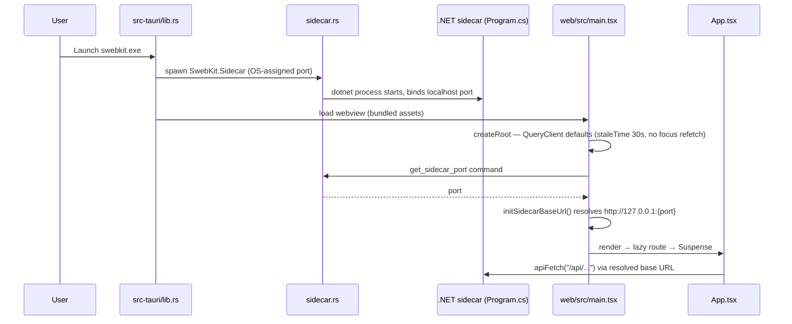
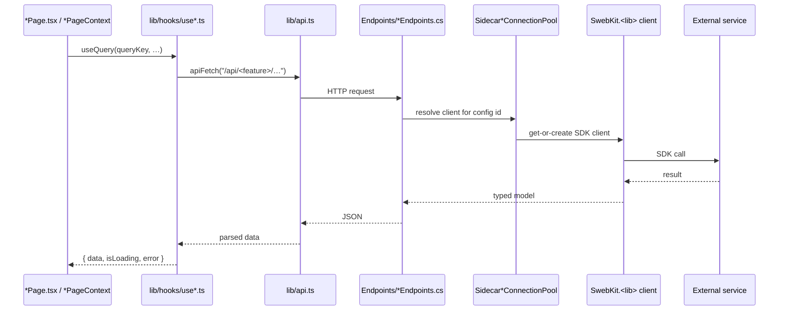
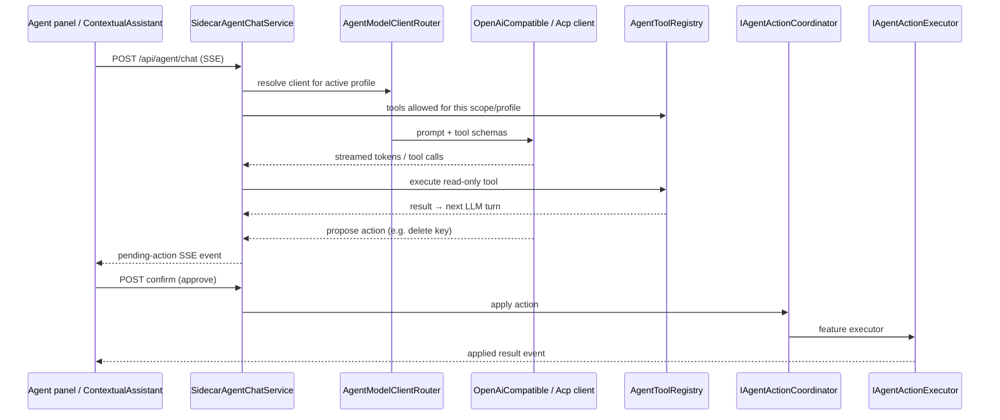
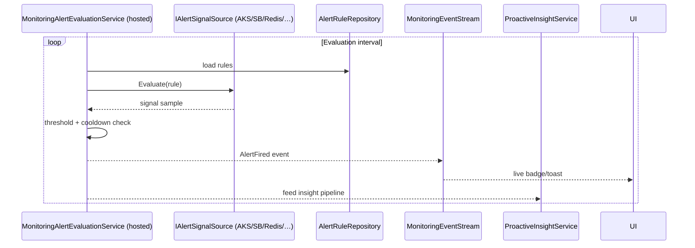
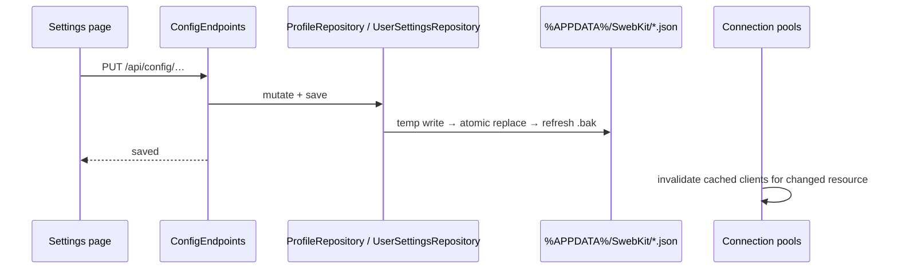

# SwebKit Design

## Mandate

**This is the component blueprint.** It answers: _how is each component internally structured, and
what are the key flows through it?_

Update this file when control flow, runtime responsibilities, or integration boundaries change
inside a component.

## Scope

Key flows of the active stack (Tauri + React + sidecar):

- App bootstrap and sidecar lifecycle
- Feature data flow (page → hook → `api.ts` → endpoint → pooled client)
- Demo mode
- Agent chat and confirm-before-execute actions
- Monitoring alert evaluation and SSE fan-out
- Settings save and config propagation
- High-volume streams (logs, monitoring events)

Folder maps and broad navigation conventions live in `codebase-guide.md`.

## App Bootstrap Flow

### Intent

Render UI fast while the Rust shell spawns the sidecar on an OS-assigned port; never fire an API
call before the port is known.

### High-Level Sequence

### Design Notes

- Dev (`npm run dev` / Playwright) uses a **fixed** port `5199`; production asks Tauri for the
  OS-assigned one — `initSidecarBaseUrl()` must resolve before any fetch fires.
- `refetchOnWindowFocus: false` is deliberate: alt-tab back must not replay a full
  namespace/cluster fan-out; volatile queries set their own short `staleTime`.
- Program.cs wires `AppBootstrap.ConfigureCrashHandlers` first so even a startup throw lands in
  the file log, then registers all DI, then `Map*Endpoints` per feature.

## Feature Data Flow

### Intent

One predictable pipeline per feature: component → TanStack hook → typed api call → minimal-API
endpoint → pooled SDK client → external service.

### High-Level Sequence

### Design Notes

- `Sidecar*ConnectionPool` exists per integration (Service Bus, Redis, Storage, SQL, Monitoring) —
  endpoints never construct SDK clients directly; that caused the original per-request leak.
- Secrets travel by logical key; `SidecarCredentialStore` resolves them from the OS keychain via
  Tauri commands — raw secrets never sit in `profiles.json`.
- Deep-linkable state lives in URL search params (`useSearchParams`), not in component state — a
  reload or shared link restores the same selection.
- Mutations go through `apiSend`; destructive ones surface a `ConfirmBar`/dialog per the
  UI-guardrails skill.

## Demo Mode Flow

`AppStateService.UseDemoData` swaps every client factory for a `Demo*` implementation at the
connection-pool/selector seam — endpoints and UI are unaware. `DemoModeService` seeds the demo
namespace/cache/storage/SQL IDs the UI lists. The entire Playwright suite runs in demo mode, so a
demo regression breaks e2e immediately.

## Agent Chat + Confirm-Before-Execute Flow

### Intent

Stream LLM replies with tool steps, keep "propose → user confirms → apply" for any mutation, and
let the built-in client or an external ACP agent serve the same UI.

### High-Level Sequence

### Design Notes

- `AgentModelClientRouter` resolves the model client **per call** — switching agent profiles needs
  no restart.
- Every `IAgentTool` is a singleton in `Program.cs`; `InvestigateWorkspaceIssueTool` resolves the
  registry lazily via `IServiceProvider` to avoid the circular dependency.
- External ACP agents reach the same tool registry through `SwebKitToolsMcpBridge` (stateless MCP
  over streamable HTTP; per-session allowlist in the `?tools=` URL param).
- `ProactiveInsightService` must be force-instantiated at startup — its constructor subscribes to
  `MonitoringAlertEvaluationService.AlertFired`.

## Monitoring Alert Flow

- One engine singleton serves both the hosted-service lifetime and endpoint `ReloadRulesAsync`
  calls after rule CRUD.
- Signal sources register twice in DI: concrete type + `IAlertSignalSource`, so the engine
  resolves `IEnumerable<IAlertSignalSource>`.

## Settings Save and Config Propagation Flow

- Repos write atomically (temp + replace) and keep a sibling `.bak` for recovery.
- Some settings are read live rather than snapshotted — e.g. the API-client "verify SSL" toggle is
  consulted per request inside the named `HttpClient` handler, so it applies immediately.

## High-Volume Stream Flow

- **Logs (AKS/agent):** SSE/`EventSource` from the sidecar; frontend uses
  `useLogBuffer`/`log-window.ts` to buffer lines and flush on a timer — never render per line.
  Every `EventSource` is closed in effect cleanup.
- **Monitoring events:** `MonitoringEventStream` broadcasts engine events over SSE.
- See `docs/pitfalls/react-frontend.md` for the full rules.

## Key Reference Points

| File                                        | Responsibility                                              |
| ------------------------------------------- | ----------------------------------------------------------- |
| `src-sidecar/Program.cs`                    | DI root, CORS, global exception handler, endpoint mapping   |
| `web/src/main.tsx`                          | QueryClient defaults, sidecar URL resolution, mount         |
| `web/src/lib/api.ts`                        | `apiFetch`/`apiSend`, error-message extraction              |
| `src-sidecar/Services/DemoModeService.cs`   | Demo-mode resource seeds                                    |
| `src/SwebKit.Core/Configuration/*Repository` | Atomic JSON persistence                                    |
