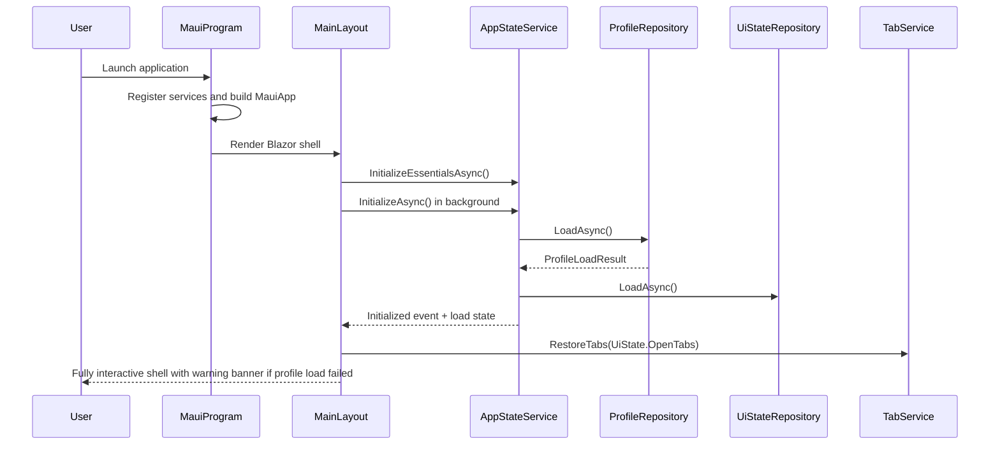
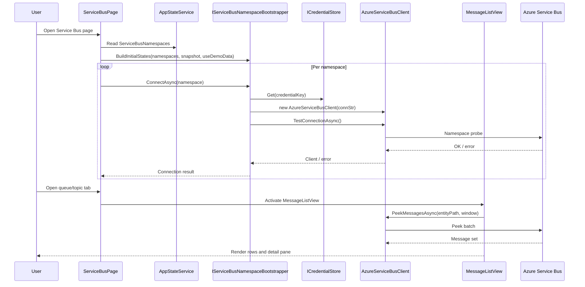
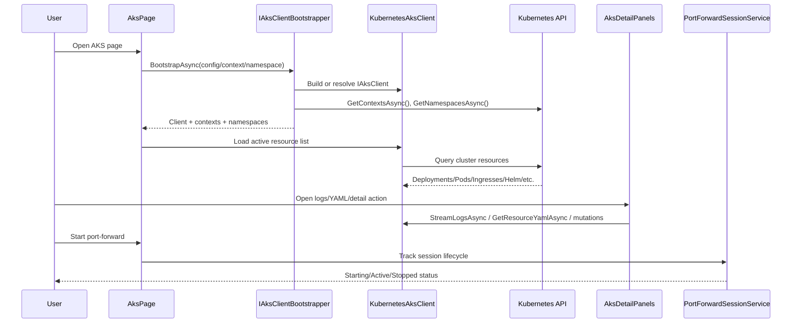
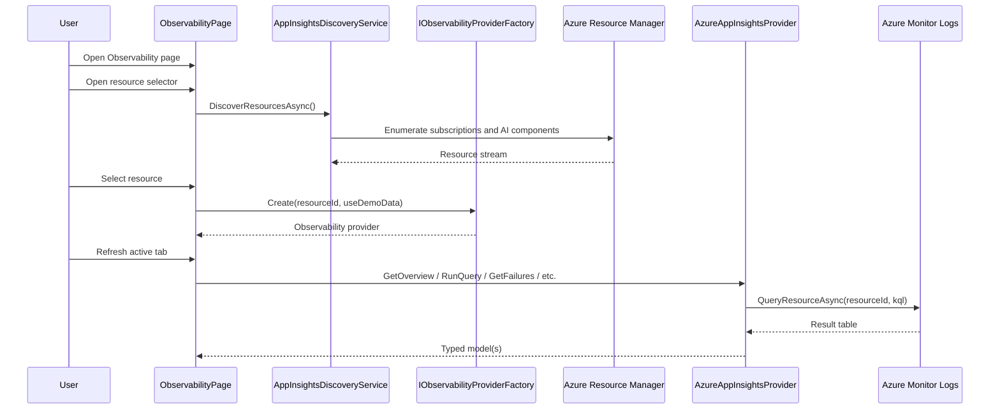
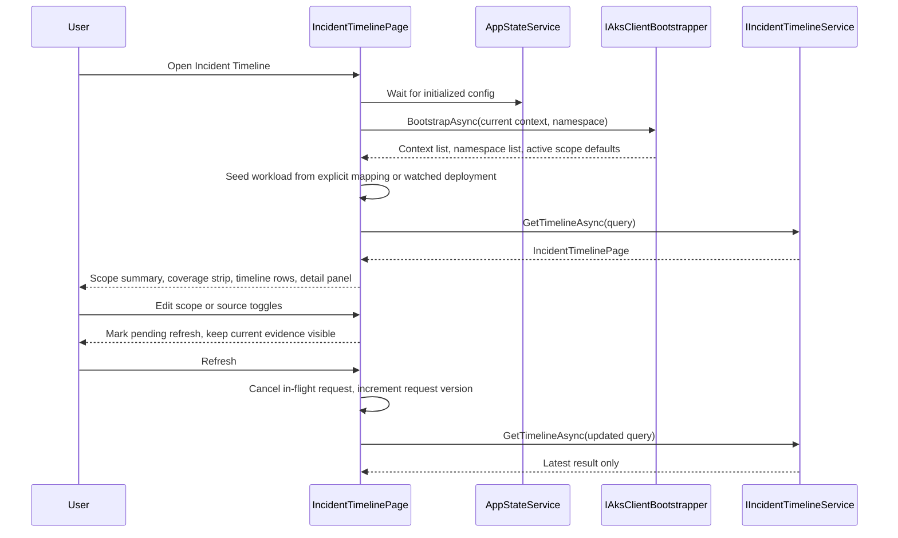
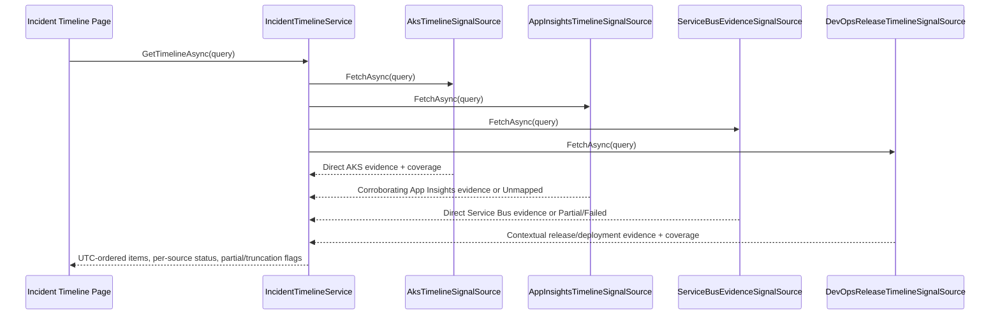
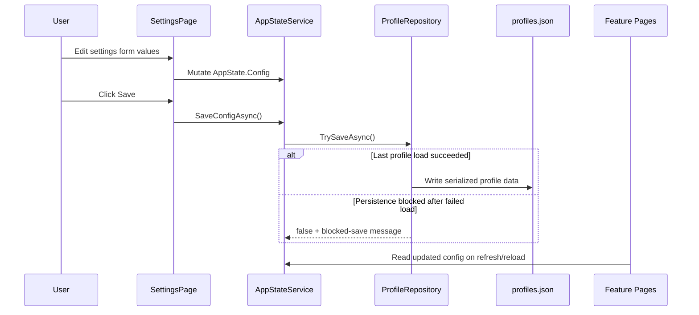

# SwebKit Design

## Mandate

**This is the component blueprint.** It answers: _how is each component internally structured, and what are the key flows through it?_

Update this file when control flow, runtime responsibilities, or integration boundaries change inside a component.

## Scope

This document expands [architecture.md](architecture.md) for the most important implementation flows:

- App bootstrap and shell hydration
- Service Bus namespace connection and message browsing
- AKS diagnostics and side-panel operations
- Observability resource selection and query execution
- Incident timeline workbench bootstrap, request-state, and evidence inspection
- Settings persistence and config propagation

Folder maps and broad navigation conventions are intentionally kept in `codebase-guide.md`.

## App Bootstrap Flow

### Intent

Start the MAUI host quickly, hydrate persisted state in the background, and render the shell without blocking initial UI.

### High-Level Sequence

### Design Notes

- `MainLayout` uses two-phase startup: immediate shell render, then full state hydration.
- `ProfileRepository.LoadAsync()` returns `ProfileLoadResult`; `AppStateService` keeps startup non-fatal but blocks profile persistence after a failed load so `profiles.json` is not overwritten.
- `MainLayout` renders the shell even on profile-load failure and surfaces a non-fatal warning banner from `AppState.HasProfileLoadFailure`.
- `AppStateService` raises `Initialized` and `DemoModeChanged` so layouts and pages can re-render safely.
- Keyboard shortcuts are registered from `OnAfterRenderAsync` to avoid JS interop calls before a DOM is available.

## Service Bus Namespace and Message Browse Flow

### Intent

Connect each configured namespace independently, then allow queue/topic tab workflows (peek, filter, compose, DLQ actions) with resilient UI behavior.

### High-Level Sequence

### Design Notes

- Namespace connectivity is fan-out and non-atomic; one namespace can fail while others stay usable.
- Initial namespace state is restored from `PageDataCache` snapshot data before reconnect fan-out begins, so the namespace list renders immediately on return navigation.
- Tab state is local (`SbTab`), so each open entity maintains its own selected message and mode.
- Message-list preferences and filter presets are persisted through `UiStateRepository` scope keys.
- Mutative operations (delete, purge, DLQ replay/complete) route through shared `IServiceBusClient` contracts and UI confirmations.

## AKS Diagnostics Flow

### Intent

Provide responsive cluster diagnostics (resource lists, logs, YAML, shell, port-forward) while keeping the grid and navigation usable during side operations.

### High-Level Sequence

### Design Notes

- `KubernetesAksClient` retries on auth failures by rebuilding client config and reapplying Azure token fallback.
- `AksPage` starts bootstrap in fire-and-forget mode from `OnParametersSet`, but guards the signature first so parent re-renders do not retrigger identical reconnect work.
- Auto-refresh is intentionally paused when detail panels are open to avoid disrupting active diagnostic context.
- Port-forward process tracking is centralized in `IPortForwardSessionService`, and cleanup runs during process exit.

## Observability Resource and Query Flow

### Intent

Discover accessible Application Insights resources, bind one provider instance to the selected resource, and execute tab-specific KQL queries.

### High-Level Sequence

### Design Notes

- Resource discovery is cached in-memory by `AppInsightsDiscoveryService` for session reuse.
- Failure-to-logs drill-through uses an explicit pending-query request and child acknowledgment between `ObservabilityPage` and `ObservabilityLogs`; it no longer relies on a render-timing delay.
- The selected resource ID/name persists in `AppState.Config.ObservabilityConfig`.
- Demo mode swaps both discovery and provider implementations without changing page-level flow.

## Incident Timeline Frontend Workbench Flow

### Intent

Bootstrap workload scope from the current AKS context, keep manual refresh explicit, and present one evidence-first workbench with visible source coverage and a detail panel.

### High-Level Sequence

### Design Notes

- `IncidentTimelinePage` uses `IAksClientBootstrapper` to normalize context and namespace selection so the workbench follows the same AKS bootstrap seam as the AKS page.
- The page keeps draft scope edits separate from the currently loaded result. It shows a pending-refresh summary instead of auto-loading on every edit.
- Each refresh cancels any in-flight request and applies results only when the request version matches the latest requested scope.
- The UI never re-implements inclusion logic. It only projects `IncidentTimelinePage`, `IncidentTimelineItem`, and `IncidentTimelineSourceStatus` from `SwebKit.Core`.

## Incident Timeline Backend Aggregation Flow

### Intent

Assemble workload-scoped incident evidence from AKS, App Insights, Service Bus, and Azure DevOps without moving merge logic into the UI and without inventing ownership heuristics.

### High-Level Sequence

### Design Notes

- `IncidentTimelineService` owns fan-out, per-source timeout budgets, deterministic UTC ordering, and best-effort partial results.
- AKS is the anchor source; non-AKS sources participate only when `AppConfig.IncidentTimeline.WorkloadMappings` explicitly maps them to the selected workload.
- Source adapters return coverage states (`Loaded`, `Partial`, `Unmapped`, `TimedOut`, `Failed`, etc.) so the UI can surface incomplete evidence without guessing.
- The backend currently supports AKS `Deployment`, `StatefulSet`, and `Pod` scopes. `DaemonSet` is intentionally left unsupported until a dedicated AKS contract exists.

## Settings Save and Config Propagation Flow

### Intent

Allow per-environment configuration updates from UI forms while keeping secrets external to configuration files.

### High-Level Sequence

### Design Notes

- Settings edits are in-memory until explicit save.
- `SaveConfigAsync()` returns `false` when profile persistence is blocked after a failed load; settings forms surface the blocked-save message and keep the current session state in memory.
- Credentials are referenced by logical keys; secret material remains in credential store.
- DevOps settings validation and live pages create fresh clients through `IDevOpsClientFactory`; saving settings affects only future client snapshots.
- Environment selection is profile-based (`Environments` and `ActiveEnvironmentName` in `ProfileData`).

## Key Reference Points

| File                                                                                                 | Responsibility                                                                         |
| ---------------------------------------------------------------------------------------------------- | -------------------------------------------------------------------------------------- |
| `src/SwebKit.App/MauiProgram.cs`                                                                     | DI composition root and infrastructure registration.                                   |
| `src/SwebKit.App/Components/Layout/MainLayout.razor`                                                 | App shell lifecycle, startup sequencing, and global command registration.              |
| `src/SwebKit.Core/Services/AppStateService.cs`                                                       | Shared app state, initialization, demo mode toggling, and persistence calls.           |
| `src/SwebKit.Core/Configuration/ProfileRepository.cs`                                                | Profile/environment load-save lifecycle for `profiles.json`.                           |
| `src/SwebKit.Core/Configuration/UiStateRepository.cs`                                                | UI state persistence (`ui-state.json`) including tabs, filters, and view preferences.  |
| `src/SwebKit.App/Components/Pages/ServiceBusPage.razor`                                              | Service Bus page orchestration, namespace lifecycle, tab workspace behavior.           |
| `src/SwebKit.App/Services/ServiceBusNamespaceBootstrapper.cs`                                        | Service Bus namespace bootstrap and connection seam used by the page.                  |
| `src/SwebKit.Azure/ServiceBus/AzureServiceBusClient.cs`                                              | Service Bus SDK implementation and message/entity operations.                          |
| `src/SwebKit.App/Components/Pages/AksPage.razor`                                                     | AKS page orchestration and resource panel lifecycle.                                   |
| `src/SwebKit.App/Services/AksClientBootstrapper.cs`                                                  | AKS client/context/namespace bootstrap seam used by the page.                          |
| `src/SwebKit.Kubernetes/AksClient/KubernetesAksClient.cs`                                            | Kubernetes operations, auth fallback, and log/port-forward behavior.                   |
| `src/SwebKit.App/Components/Pages/ObservabilityPage.razor`                                           | Resource selection, tab routing, and provider-driven refresh logic.                    |
| `src/SwebKit.App/Services/ObservabilityProviderFactory.cs`                                           | Observability provider activation seam for demo/live resource binding.                 |
| `src/SwebKit.Observability/AzureAppInsightsProvider.cs`                                              | KQL execution and typed observability result mapping.                                  |
| `src/SwebKit.App/Components/Pages/IncidentTimelinePage.razor`                                        | Incident timeline workbench orchestration, request cancellation, and detail selection. |
| `src/SwebKit.App/Components/IncidentTimeline/`                                                       | Incident timeline toolbar, coverage, list, row, detail panel, and empty-state UI.      |
| `src/SwebKit.Core/Abstractions/IIncidentTimelineService.cs`                                          | Aggregated incident evidence service consumed by the page.                             |
| `src/SwebKit.Core/Abstractions/IDevOpsClientFactory.cs`, `src/SwebKit.DevOps/DevOpsClientFactory.cs` | Immutable live DevOps client creation from the current saved settings.                 |
| `src/SwebKit.DevOps/DevOpsClient.cs`                                                                 | Pipeline/run/approval/git integration with Azure DevOps REST APIs.                     |
