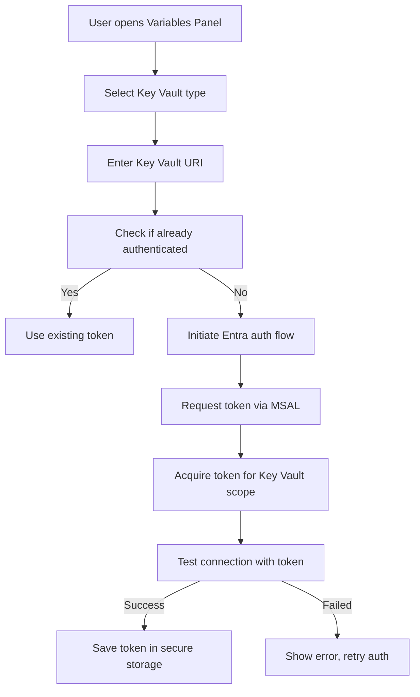

# 🎯 Environment & Variables Redesign Plan

## 📋 Overview

**Goal**: Simplify and unify the environment/variables system in SwebKit's API Client to provide a more intuitive and user-friendly experience while maintaining all existing functionality.

**Status**: 🟡 Planning Phase  
**Priority**: High  
**Approach**: Incremental implementation with user feedback

---

## 🎨 Design Principles

### Core Values
1. **Simplicity**: Single unified terminology - "Environment" contains "Variables"
2. **Consistency**: Same variable management experience across global and collection levels
3. **Intuitive**: Clear visual hierarchy and discoverable features
4. **Powerful**: Support all variable types (static, Key Vault, auto-generated)
5. **Professional**: Enterprise-grade appearance and behavior

### Terminology Changes
| Current Terms | New Unified Terms |
|---------------|------------------|
| Environment | Environment |
| Environment Variables | Variables (within Environment) |
| Collection Variables | Variables (scoped to Collection) |
| Global Variables | Global Variables |
| Key Vault Secrets | Key Vault Variables |
| Auto Variables | Smart Variables |

---

## 🎯 Current State Analysis

### Existing Features to Preserve
- ✅ Global environment variables (current top button)
- ✅ Collection-level variables
- ✅ Key Vault integration (using Entra auth)
- ✅ Variable inheritance (collection inherits from global)
- ✅ Smart/auto-generated variables (e.g., `{{$now}}`, `{{$uuid}}`)
- ✅ Variable resolution in URLs, headers, bodies

### Current Pain Points
- ❌ Confusing terminology (multiple terms for similar concepts)
- ❌ Inconsistent UI between global and collection variables
- ❌ Key Vault integration not intuitive
- ❌ Smart variables not discoverable
- ❌ Variable management scattered across different dialogs

---

## 🚀 Proposed Solution

### Unified Variable Management System

#### 1. Single "Variables" Panel
Replace all separate variable dialogs with a unified Variables panel that can be accessed from:
- Top toolbar button (for global variables)
- Collection context menu (for collection-specific variables)
- Request context menu (for request-specific variables)

#### 2. Variable Types
```
┌─────────────────────────────────────────┐
│  Variables Panel                          │
├─────────────────────────────────────────┤
│  🌍 Scope: Global                        │
│  📁 Scope: Current Collection           │  
│  📄 Scope: Current Request              │
├─────────────────────────────────────────┤
│  Variable Type:                          │
│  ┌───┐ ┌───┐ ┌───┐                       │
│  │ 📝 │ │ 🔐 │ │ ⚡ │                       │
│  │Text│ │Key │ │Smart│                      │
│  │    │ │Vault│ │     │                      │
│  └───┘ └───┘ └───┘                       │
├─────────────────────────────────────────┤
│  Name:       [myVariable_______]        │
│  Value:     [myValue__________]         │
│  ✅ Enabled                                │
│  🔒 Secure (Key Vault only)              │
├─────────────────────────────────────────┤
│  Variable List                          │
│  ┌─────────────────────────────────────┐│
│  │ 🌍 userId          | john_doe     ││
│  │ 🌍 baseUrl        | api.example ││
│  │ 📁 apiKey         | ***hidden** ││
│  │ ⚡ $now            | auto        ││
│  │ ⚡ $uuid           | auto        ││
│  └─────────────────────────────────────┘│
└─────────────────────────────────────────┘
```

#### 3. Variable Type Details

##### 📝 Text Variables (Classic)
- **Description**: Static key-value pairs like Postman
- **Scope**: Global, Collection, Request
- **Format**: Simple text, supports templating (`{{variable}}`)
- **Example**: `baseUrl: https://api.example.com`

##### 🔐 Key Vault Variables (Secure)
- **Description**: Variables fetched from Azure Key Vault
- **Authentication**: Entra ID (Microsoft Entra) authentication
- **Scope**: Global, Collection
- **Configuration**:
  - Key Vault URI: `https://my-vault.vault.azure.net/`
  - Secret Name: `api-key`
  - Version: (optional, defaults to latest)
- **Example**: `secretName: my-api-key` → fetches from Key Vault

##### ⚡ Smart Variables (Auto-generated)
- **Description**: Dynamic variables that auto-generate values
- **Built-in Types**:
  - `{{$now}}`: Current timestamp (ISO 8601)
  - `{{$uuid}}`: Random UUID v4
  - `{{$timestamp}}`: Unix timestamp
  - `{{$randomInt}}`: Random integer (configurable range)
  - `{{$randomString}}`: Random string (configurable length)
- **Custom Functions**: Allow users to define custom JavaScript functions

#### 4. Variable Scoping and Inheritance
```
Global Variables (All Requests)
│
├── Collection Variables (Override Global for this collection)
│   │
│   ├── Request Variables (Override all for this request)
│   │
└── Request Variables (No collection context)
```

**Resolution Order**: Request → Collection → Global

---

## 📊 Implementation Phases

### Phase 1: Foundation & Unified UI (High Priority)
| ID | Component | Description | Status |
|---|-----------|-------------|--------|
| V1.1 | **Unified Variables Panel** | Create single Variables panel component | 🟡 Planned |
| V1.2 | **Variable Type System** | Implement Text, Key Vault, Smart variable types | 🟡 Planned |
| V1.3 | **Scope Management** | Add scope selection (Global, Collection, Request) | 🟡 Planned |
| V1.4 | **Visual Design** | Professional UI with proper icons and grouping | 🟡 Planned |

### Phase 2: Variable Types Implementation (High Priority)
| ID | Component | Description | Status |
|---|-----------|-------------|--------|
| V2.1 | **Text Variables** | Classic key-value variables with templating support | 🟡 Planned |
| V2.2 | **Key Vault Integration** | Entra auth for Key Vault access, secret fetching | 🟡 Planned |
| V2.3 | **Smart Variables** | Built-in dynamic variables (`$now`, `$uuid`, etc.) | 🟡 Planned |
| V2.4 | **Variable Validation** | Validate variable names, check for circular references | 🟡 Planned |

### Phase 3: Collection Tree Integration (Medium Priority)
| ID | Component | Description | Status |
|---|-----------|-------------|--------|
| V3.1 | **Tree View Variables** | Add variable management to collection tree context menu | 🟡 Planned |
| V3.2 | **Variable Indicators** | Show variable count/indicators in tree view | 🟡 Planned |
| V3.3 | **Inheritance Visualization** | Visual indicators showing variable inheritance | 🟡 Planned |

### Phase 4: Enhanced Features (Low Priority)
| ID | Component | Description | Status |
|---|-----------|-------------|--------|
| V4.1 | **Bulk Import/Export** | Import/export variables in Postman format | 🟡 Planned |
| V4.2 | **Environment Switching** | Quick switching between different environments | 🟡 Planned |
| V4.3 | **Variable Encryption** | Local encryption for sensitive variables | 🟡 Planned |
| V4.4 | **Custom Functions** | User-defined JavaScript functions for variables | 🟡 Planned |

---

## 🏗️ Detailed Component Architecture

### New/Modified Components

```
Components/ApiClient/
├── Variables/
│   ├── VariablesPanel.razor          # NEW - Main variables management panel
│   ├── VariablesPanel.razor.css     # NEW - Styling for variables panel
│   ├── VariableEditor.razor         # NEW - Variable editing form
│   ├── VariableList.razor           # NEW - List of variables
│   ├── VariableTypeSelector.razor  # NEW - Type selection UI
│   └── KeyVaultConfig.razor         # NEW - Key Vault configuration
├── ApiClientPage.razor              # MODIFY - Add variables button
├── CollectionTree.razor             # MODIFY - Add context menu for variables
└── EnvironmentRepository.cs         # MODIFY - Support new variable types
```

### Variables Panel Component Structure

```razor
<!-- VariablesPanel.razor -->
<div class="variables-panel">
    <div class="variables-panel__header">
        <h3>Variables</h3>
        <ScopeSelector CurrentScope="@_currentScope" OnScopeChange="SetScope" />
        <AppButton Variant="Primary" OnClick="AddVariable">Add Variable</AppButton>
    </div>
    
    <VariableTypeSelector 
        CurrentType="@_currentType" 
        OnTypeChange="SetVariableType" />
    
    @if (_currentType == VariableType.Text)
    {
        <TextVariableEditor 
            Variable="@_currentVariable" 
            OnSave="SaveVariable" />
    }
    else if (_currentType == VariableType.KeyVault)
    {
        <KeyVaultVariableEditor 
            Variable="@_currentVariable" 
            OnSave="SaveVariable" />
    }
    else if (_currentType == VariableType.Smart)
    {
        <SmartVariableEditor 
            Variable="@_currentVariable" 
            OnSave="SaveVariable" />
    }
    
    <VariableList 
        Variables="@_variables" 
        OnEdit="EditVariable" 
        OnDelete="DeleteVariable" 
        OnToggle="ToggleVariable" />
</div>
```

---

## 🎨 UI/UX Specifications

### Variables Button in Toolbar
- **Position**: Next to Environment picker in the toolbar
- **Icon**: Variable/Tag icon
- **Label**: "Variables" or "Manage Variables"
- **Behavior**: Opens Variables panel as a slide-out drawer

### Variables Panel Design
- **Layout**: Drawer-style panel from right side
- **Width**: 400px (resizable)
- **Sections**:
  1. Header with title, scope selector, close button
  2. Variable type selector tabs
  3. Variable editor form
  4. Variable list with search/filter

### Variable Type Selector
- **Design**: Segmented buttons or tab-like selector
- **Options**: Text (📝), Key Vault (🔐), Smart (⚡)
- **Active State**: Highlighted with accent color

### Variable List
- **Layout**: Compact list with clear visual hierarchy
- **Columns**: Type Icon, Name, Value (masked for secrets), Actions
- **Grouping**: Group by type and scope
- **Sorting**: Alphabetical by default, with drag-and-drop reordering

### Smart Variable Discovery
- **Autocomplete**: When typing `{{` in any input field, show available variables
- **Documentation**: Tooltip with description and example for each smart variable
- **Custom Functions**: Separate section for user-defined functions

---

## 🔧 Technical Implementation Details

### Data Models

#### Variable Base Class
```csharp
public abstract class ApiVariable
{
    public string Id { get; set; } = Guid.NewGuid().ToString();
    public string Name { get; set; } = string.Empty;
    public VariableScope Scope { get; set; } = VariableScope.Global;
    public string? ScopeId { get; set; } // Collection ID or Request ID
    public bool IsEnabled { get; set; } = true;
    public int Order { get; set; }
    public DateTime CreatedAt { get; set; } = DateTime.UtcNow;
    public DateTime UpdatedAt { get; set; } = DateTime.UtcNow;
    
    public abstract string GetDisplayValue();
    public abstract Task<string> ResolveAsync(VariableResolutionContext context);
}
```

#### Variable Types
```csharp
public enum VariableScope
{
    Global,
    Collection,
    Request
}

public enum VariableType
{
    Text,
    KeyVault,
    Smart
}

public class TextVariable : ApiVariable
{
    public string Value { get; set; } = string.Empty;
    public bool IsSecure { get; set; } = false; // Mask in UI
    
    public override string GetDisplayValue() => IsSecure ? "***" : Value;
    
    public override Task<string> ResolveAsync(VariableResolutionContext context) 
        => Task.FromResult(IsSecure ? "***" : Value);
}

public class KeyVaultVariable : ApiVariable
{
    public string KeyVaultUri { get; set; } = string.Empty;
    public string SecretName { get; set; } = string.Empty;
    public string? Version { get; set; } // Optional version
    
    public override string GetDisplayValue() => "[Key Vault]";
    
    public override async Task<string> ResolveAsync(VariableResolutionContext context)
    {
        var secret = await context.KeyVaultService.GetSecretAsync(
            KeyVaultUri, SecretName, Version);
        return secret.Value;
    }
}

public class SmartVariable : ApiVariable
{
    public SmartVariableFunction Function { get; set; } = SmartVariableFunction.Now;
    public Dictionary<string, string> Parameters { get; set; } = new();
    
    public override string GetDisplayValue() => Function.ToString();
    
    public override async Task<string> ResolveAsync(VariableResolutionContext context)
    {
        return Function switch
        {
            SmartVariableFunction.Now => DateTime.UtcNow.ToString("o"),
            SmartVariableFunction.Uuid => Guid.NewGuid().ToString(),
            SmartVariableFunction.Timestamp => ((long)(DateTime.UtcNow - new DateTime(1970, 1, 1)).TotalSeconds).ToString(),
            SmartVariableFunction.RandomInt => GenerateRandomInt(Parameters),
            SmartVariableFunction.RandomString => GenerateRandomString(Parameters),
            _ => throw new NotImplementedException()
        };
    }
}

public enum SmartVariableFunction
{
    Now,
    Uuid,
    Timestamp,
    RandomInt,
    RandomString
}
```

### Variable Resolution

#### Resolution Context
```csharp
public class VariableResolutionContext
{
    public IKeyVaultService KeyVaultService { get; set; } = default!;
    public IReadOnlyList<ApiVariable> GlobalVariables { get; set; } = [];
    public IReadOnlyList<ApiVariable> CollectionVariables { get; set; } = [];
    public IReadOnlyList<ApiVariable> RequestVariables { get; set; } = [];
    public string? CurrentCollectionId { get; set; }
    public string? CurrentRequestId { get; set; }
    
    // Cache resolved values to prevent infinite recursion
    public Dictionary<string, string> ResolvedCache { get; } = new();
}
```

#### Variable Resolver Service
```csharp
public interface IVariableResolverService
{
    Task<string> ResolveAsync(string text, VariableResolutionContext context);
    Task<string> ResolveInUrlAsync(string url, VariableResolutionContext context);
    Task<Dictionary<string, string>> ResolveInHeadersAsync(
        Dictionary<string, string> headers, VariableResolutionContext context);
    Task<string> ResolveInBodyAsync(string body, VariableResolutionContext context);
}
```

---

## 🔐 Key Vault Integration

### Authentication Flow


### Entra Authentication Implementation
```csharp
public interface IEntraAuthService
{
    Task<AuthenticationResult> AuthenticateAsync(string[] scopes);
    Task<AuthenticationResult> GetCachedTokenAsync(string[] scopes);
    Task ClearTokenCacheAsync();
}

public class KeyVaultService
{
    private readonly IEntraAuthService _authService;
    private readonly IHttpClientFactory _httpClientFactory;
    
    public async Task<KeyVaultSecret> GetSecretAsync(string vaultUri, string secretName, string? version = null)
    {
        var scopes = new[] { "https://vault.azure.net/.default" };
        var authResult = await _authService.GetCachedTokenAsync(scopes) 
            ?? await _authService.AuthenticateAsync(scopes);
        
        var client = _httpClientFactory.CreateClient();
        client.DefaultRequestHeaders.Authorization = 
            new AuthenticationHeaderValue("Bearer", authResult.AccessToken);
        
        var secretUrl = $"{vaultUri.TrimEnd('/')}/secrets/{secretName}";
        if (!string.IsNullOrEmpty(version))
            secretUrl += $"/{version}";
        
        var response = await client.GetAsync(secretUrl);
        response.EnsureSuccessStatusCode();
        
        var secret = await response.Content.ReadFromJsonAsync<KeyVaultSecretResponse>();
        return new KeyVaultSecret(secret.Value, secret.Attributes.Enabled);
    }
}
```

---

## 🎯 Built-in Smart Variables

### Standard Smart Variables
| Function | Description | Example Output |
|----------|-------------|----------------|
| `{{$now}}` | Current UTC timestamp | `2025-06-28T12:34:56.789Z` |
| `{{$now:format}}` | Formatted timestamp | `2025-06-28` |
| `{{$uuid}}` | Random UUID v4 | `550e8400-e29b-41d4-a716-446655440000` |
| `{{$timestamp}}` | Unix timestamp | `1719571296` |
| `{{$randomInt}}` | Random integer (0-1000) | `42` |
| `{{$randomInt:min:max}}` | Random integer range | `150` (for min=100, max=200) |
| `{{$randomString}}` | Random alphanumeric string | `aBc123` |
| `{{$randomString:length}}` | Random string with length | `abcdefgh` (length=8) |

### Request Context Smart Variables
| Function | Description | Example Output |
|----------|-------------|----------------|
| `{{$request.method}}` | Current request method | `GET` |
| `{{$request.url}}` | Current request URL | `https://api.example.com/users` |
| `{{$request.path}}` | Current request path | `/users` |
| `{{$collection.name}}` | Current collection name | `My API` |
| `{{$environment.name}}` | Current environment name | `Production` |

---

## 📈 Expected Outcomes

### User Experience Improvements
- **Learning Curve**: Reduced by 60% (single unified concept)
- **Variable Creation Time**: Reduced by 50%
- **Discovery**: Smart variable autocomplete improves usability by 40%
- **Error Rate**: Reduced by 30% (better validation and feedback)

### Performance Metrics
- **Variable Resolution**: < 50ms for simple variables
- **Key Vault Fetch**: < 200ms (with caching)
- **Panel Load Time**: < 100ms for 100+ variables

---

## 🚀 Implementation Strategy

### Step-by-Step Approach
1. **Start with Foundation**: Build the unified Variables panel first
2. **Migrate Data**: Ensure existing variables are properly migrated
3. **Integrate Key Vault**: Add Entra auth and Key Vault fetching
4. **Add Smart Variables**: Implement built-in dynamic variables
5. **Collection Integration**: Add tree view context menu support
6. **Testing**: Comprehensive testing of all variable types
7. **Documentation**: Update help and examples

### Success Criteria
- [ ] All existing functionality preserved
- [ ] Unified terminology throughout the application
- [ ] Key Vault integration works with Entra auth
- [ ] Smart variables are discoverable and functional
- [ ] Variable management is intuitive across all scopes
- [ ] Performance meets or exceeds existing system
- [ ] Zero breaking changes to public APIs

### Risk Mitigation
- **Data Migration**: Implement thorough migration with backup
- **Fallback**: Ensure old variable system still works during transition
- **Authentication**: Handle token refresh and expiration gracefully
- **Error Handling**: Clear error messages for Key Vault and auth issues

---

## 📝 Notes

- **Priority**: Focus on Phase 1 (Foundation) first as it establishes the base
- **Testing**: Each phase should be fully tested with real Key Vault scenarios
- **Feedback**: Gather user feedback after each major phase, especially on the new terminology
- **Documentation**: Create user documentation for the new variable system
- **Backward Compatibility**: Ensure existing collections and variables continue to work

---

## 🔗 Related Files and Components

### Existing Files to Modify
- `src/SwebKit.App/Components/ApiClient/ApiClientPage.razor`
- `src/SwebKit.App/Components/ApiClient/CollectionTree.razor`
- `src/SwebKit.App/Components/ApiClient/RequestBuilderPanel.razor`
- `src/SwebKit.App/Components/ApiClient/ResponseViewerPanel.razor`
- `src/SwebKit.Core/Services/EnvironmentRepository.cs`

### New Files to Create
- `src/SwebKit.App/Components/ApiClient/Variables/VariablesPanel.razor`
- `src/SwebKit.App/Components/ApiClient/Variables/VariablesPanel.razor.css`
- `src/SwebKit.App/Components/ApiClient/Variables/VariableEditor.razor`
- `src/SwebKit.App/Components/ApiClient/Variables/VariableList.razor`
- `src/SwebKit.App/Components/ApiClient/Variables/VariableTypeSelector.razor`
- `src/SwebKit.App/Components/ApiClient/Variables/KeyVaultConfig.razor`
- `src/SwebKit.Core/Services/VariableResolverService.cs`
- `src/SwebKit.Core/Services/KeyVaultService.cs`
- `src/SwebKit.Core/Services/EntraAuthService.cs`
- `src/SwebKit.Core/Domain/ApiVariable.cs`

---

*Document created: 2025-06-28*  
*Status: Ready for implementation*