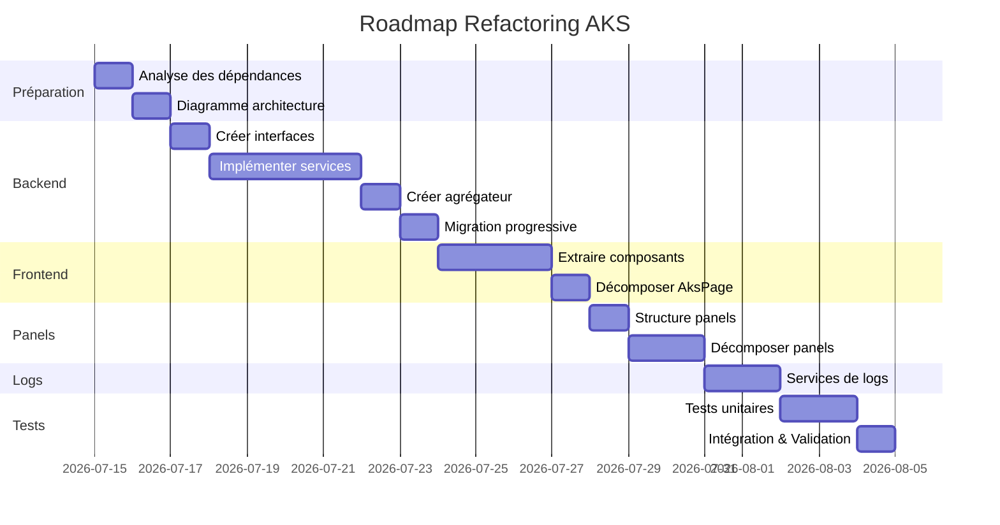

# Status - Refactoring Feature: AKS

## 📊 État Global

**Phase Actuelle** : Planification (0% libéré)
**Date de début** : À déterminer
**Date de fin estimée** : À déterminer
**Responsable** : À assigner

---

## ✅ Checklist de Progression

### Phase 1: Préparation (0/5)
- [ ] Analyser les dépendances de `KubernetesAksClient.cs`
- [ ] Identifier les interfaces existantes à réutiliser
- [ ] Créer le diagramme d'architecture cible (Mermaid)
- [ ] Préparer les tests unitaires existants pour migration
- [ ] Documenter toutes les dépendances externes (K8s SDK, etc.)

### Phase 2: Décomposition Backend (0/25)

#### Sous-Phase 2.1: Créer les interfaces (0/8)
- [ ] Créer `IPodService.cs` avec méthodes async
- [ ] Créer `IDeploymentService.cs`
- [ ] Créer `IServiceService.cs`
- [ ] Créer `IIngressService.cs`
- [ ] Créer `IHelmService.cs`
- [ ] Créer `IResourceService.cs`
- [ ] Créer `IKubernetesContextService.cs`
- [ ] Créer `IAksClient.cs` (interface unifiée)

#### Sous-Phase 2.2: Implémenter les services (0/7)
- [ ] Implémenter `PodService.cs` avec extraction des méthodes de pods
- [ ] Implémenter `DeploymentService.cs` avec extraction des déploiements
- [ ] Implémenter `ServiceService.cs` pour les Services K8s
- [ ] Implémenter `IngressService.cs` pour les Ingress
- [ ] Implémenter `HelmService.cs` pour Helm
- [ ] Implémenter `ResourceService.cs` pour les opérations communes
- [ ] Implémenter `KubernetesContextService.cs` pour le contexte

#### Sous-Phase 2.3: Créer l'aggrégateur (0/2)
- [ ] Créer `AksClientAggregator.cs` implémentant `IAksClient`
- [ ] Déleguer les appels aux services appropriés

#### Sous-Phase 2.4: Migration progressive (0/8)
- [ ] Remplacer l'injection de `KubernetesAksClient` par `IAksClient` dans les composants
- [ ] Mettre à jour `MauiProgram.cs` pour registre les nouveaux services (8 services)
- [ ] Tester chaque service individuellement
- [ ] Alan et Valider la compatibilité avec l'ancien API

### Phase 3: Décomposition Frontend (0/15)

#### Sous-Phase 3.1: Extraire AksToolbar (0/3)
- [ ] Créer `AksToolbar.razor` avec toute la logique de barre d'outils
- [ ] Extraire la gestion des tooltips et des menus contextuels
- [ ] Maintenir les raccourcis clavier

#### Sous-Phase 3.2: Extraire ResourceGrid (0/4)
- [ ] Créer `ResourceGrid.razor` générique et réutilisable
- [ ] Extraire la logique de filtrage et de tri
- [ ] Extraire la logique de sélection multiple
- [ ] Extraire les colonnes personnalisables

#### Sous-Phase 3.3: Extraire AksSidePanel (0/3)
- [ ] Créer `AksSidePanel.razor` comme conteneur de panels
- [ ] Implémenter la logique d'ouverture/fermeture
- [ ] Gérer la persistance de l'état des panels

#### Sous-Phase 3.4: Décomposer AksPage (0/5)
- [ ] Réduire `AksPage.razor` à la coordination uniquement
- [ ] Extraire toute la logique métier dans des services
- [ ] Utiliser les nouveaux composants enfants
- [ ] Intégrer avec toolbar, grid et sidepanel
- [ ] Valider les fonctionnalités existantes

### Phase 4: Décomposition des Panels (0/12)

#### Sous-Phase 4.1: Créer la structure des panels (0/2)
- [ ] Créer le dossier `Components/Aks/Panels/`
- [ ] Créer `AksDetailPanels.razor` comme coordinateur

#### Sous-Phase 4.2: Décomposer chaque panel (0/10)
- [ ] `AksPodDetailPanel.razor` (extraire de AksDetailPanels)
- [ ] `AksDeploymentDetailPanel.razor`
- [ ] `AksServiceDetailPanel.razor`
- [ ] `AksIngressDetailPanel.razor`
- [ ] `AksHelmDetailPanel.razor`
- [ ] `AksJobDetailPanel.razor`
- [ ] `AksCronJobDetailPanel.razor`
- [ ] `AksConfigMapDetailPanel.razor`
- [ ] `AksEventDetailPanel.razor`

### Phase 5: Amélioration des Logs (0/6)
- [ ] Créer `IPodLogService.cs` pour la logique commune des logs
- [ ] Extraire `PodLogStreamingService.cs` pour le streaming
- [ ] Extraire `PodLogAggregatorService.cs` pour l'aggrégation multi-pods
- [ ] Réduire `PodLogView.razor` avec les nouveaux services
- [ ] Réduire `MultiPodLogView.razor` avec les nouveaux services
- [ ] Tester les fonctionnalités de logs

### Phase 6: Tests et Validation (0/9)

#### Unit Tests (0/7)
- [ ] Tests unitaires pour `PodService`
- [ ] Tests unitaires pour `DeploymentService`
- [ ] Tests unitaires pour `ServiceService`
- [ ] Tests unitaires pour `IngressService`
- [ ] Tests unitaires pour `HelmService`
- [ ] Tests unitaires pour `ResourceService`
- [ ] Tests unitaires pour `KubernetesContextService`

#### Integration Tests (0/2)
- [ ] Tester la compatibilité ascendante
- [ ] Validation manuelle de toutes les fonctionnalités

## 📈 Temps Estiré

| Phase | Durée Estimée | % Complété | Restant |
|-------|---------------|------------|---------|
| Préparation | 2 jours | 0% | 2 jours |
| Backend | 7 jours | 0% | 7 jours |
| Frontend | 5 jours | 0% | 5 jours |
| Panels | 3 jours | 0% | 3 jours |
| Logs | 2 jours | 0% | 2 jours |
| Tests | 3 jours | 0% | 3 jours |
| **Total** | **22 jours** | **0%** | **22 jours** |

## 🔗 Dépendances

### Dépendances Externes
- [ ] الاستخدام `SwebKit(Kubernetes)`
- [ ] Accès à Azure Kubernetes Service SDK
- [ ] Configuration du projet .NET MAUI Blazor

### Dépendances Internes
- [ ] Fin du refactoring des [Core Services](../core-services/index.md) (optionnel mais recommandé)
- [ ] Validation de l'infrastructure de build/test

## 📝 blocage

Aucun blocage identifié pour l'instant.

## 📝 Décisions Techniques

Voir [decisions.md](./decisions.md) pour les décisions architecturales.

## 🏷️ Labels
- `refactoring`
- `aks`
- `kubernetes`
- `backend`
- `frontend`
- `performance`
- `critical`

---

*Dernière mise à jour: {{date}}*
*Prochaine révision: À déterminer*
